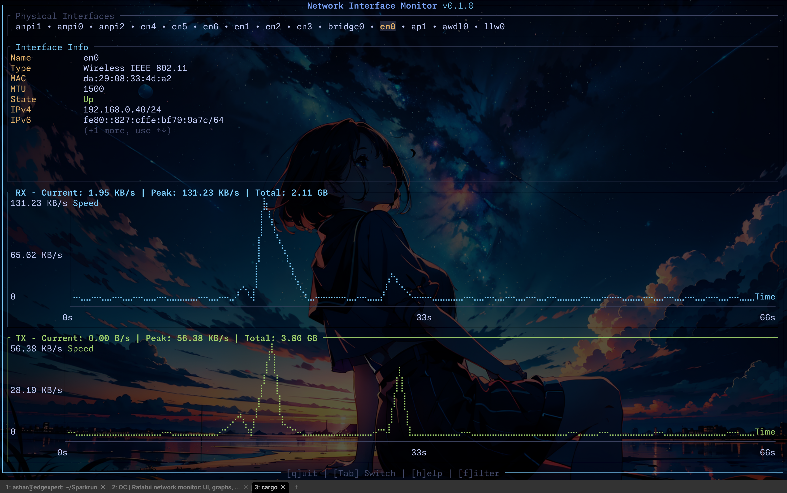

# ifmon - Interface Monitor

> A beautiful terminal-based network interface monitoring tool built with Rust and [ratatui](https://ratatui.rs/).

[](https://crates.io/crates/ifmon)




## Features

- 📊 **Real-time Monitoring** - Track RX/TX speeds with live updates every 500ms
- 📈 **Beautiful Graphs** - Smooth Braille-dot line charts showing speed history over time
- 🎯 **Dynamic Scaling** - Y-axis automatically adapts to your actual connection speed
- 🔍 **Smart Filtering** - Intelligently filters out loopback, tunnel, and virtual interfaces
- 📡 **Multi-Interface** - Easily switch between all your network interfaces
- 🌐 **IPv4 & IPv6** - Full support for both address families with scrollable display
- 🎨 **Clean Interface** - Professional TUI with color-coded stats and minimal design
- ⚡ **Lightweight** - Minimal CPU and memory footprint, perfect for always-on monitoring
- 🔧 **Cross-Platform** - Works on Linux, macOS, and BSD systems

## Quick Start

```bash
# Install from crates.io
cargo install ifmon

# Run it
ifmon
```

That's it! Use `Tab` to switch interfaces, `f` to filter, `h` for help.

## Installation

### From crates.io (Recommended)

```bash
cargo install ifmon
```

### From source

```bash
git clone https://github.com/coder3101/ifmon.git
cd ifmon
cargo build --release
```

### Pre-built Binaries

Pre-built binaries for Linux (x86_64, ARM64), macOS (Intel, Apple Silicon), and Windows are available on the [releases page](https://github.com/coder3101/ifmon/releases).

## Usage

Simply run:

```bash
ifmon
```

The interface displays three main sections:
1. **Interface Info** - Shows name, type, MAC, MTU, state, and IP addresses
2. **RX Graph** - Download speeds with current/peak/total statistics  
3. **TX Graph** - Upload speeds with current/peak/total statistics

### Keyboard Shortcuts

| Key | Action |
|-----|--------|
| `Tab` | Switch to next interface |
| `Shift+Tab` | Switch to previous interface |
| `f` | Toggle between all interfaces / physical only |
| `h` | Show/hide help screen |
| `↑` / `↓` | Scroll through IP addresses (when multiple IPs) |
| `q` or `Esc` | Quit application |

### What Gets Displayed

**Physical interfaces mode** (default):
- Ethernet, WiFi, and other physical network adapters
- Automatically filters out loopback (lo), tunnels, and virtual interfaces
- Includes any interface with assigned IP addresses

**All interfaces mode** (press `f`):
- Shows everything including loopback, bridges, tunnels, etc.

All statistics update in real-time every 500ms with dynamic graph scaling.

## Why ifmon?

Modern network monitoring tools are often complex or require root privileges. `ifmon` provides a simple, zero-configuration solution:

- **No sudo required** - Works with user-level permissions
- **Zero configuration** - Just run it, no setup needed
- **Clean output** - Focus on what matters: current speeds and trends
- **Terminal-native** - Perfect for remote SSH sessions or tmux setups
- **Platform support**: Cross-platform via `netdev` crate

## Requirements

- **Rust**: 1.70 or higher (for building)
- **Terminal**: Unicode and color support recommended
- **OS**: Linux, macOS, or BSD systems

## Building from Source

```bash
git clone https://github.com/coder3101/ifmon.git
cd ifmon
cargo build --release
```

## License

This project is licensed under the MIT License - see the [LICENSE](LICENSE) file for details.

## Author

**Mohammad Ashar Khan** - [coder3101](https://github.com/coder3101)

## Acknowledgments

Built with excellent open-source tools:

- **[ratatui](https://ratatui.rs/)** - Rust library for building rich terminal UIs
- **[netdev](https://crates.io/crates/netdev)** - Cross-platform network interface statistics
- **[crossterm](https://crates.io/crates/crossterm)** - Terminal manipulation library

Inspired by classic tools: `iftop`, `nethogs`, `bmon`

## Similar Projects

- **[bandwhich](https://github.com/imsnif/bandwhich)** - Per-process bandwidth monitor (requires root)
- **[bottom](https://github.com/ClementTsang/bottom)** - System monitor with network stats
- **[zenith](https://github.com/bvaisvil/zenith)** - htop-like system monitor

`ifmon` focuses specifically on interface-level monitoring with zero configuration and no `sudo` access.

---

**Made with ❤️ by [Mohammad Ashar Khan](https://github.com/coder3101)**

If you find this useful, consider giving it a ⭐ on [GitHub](https://github.com/coder3101/ifmon)!
